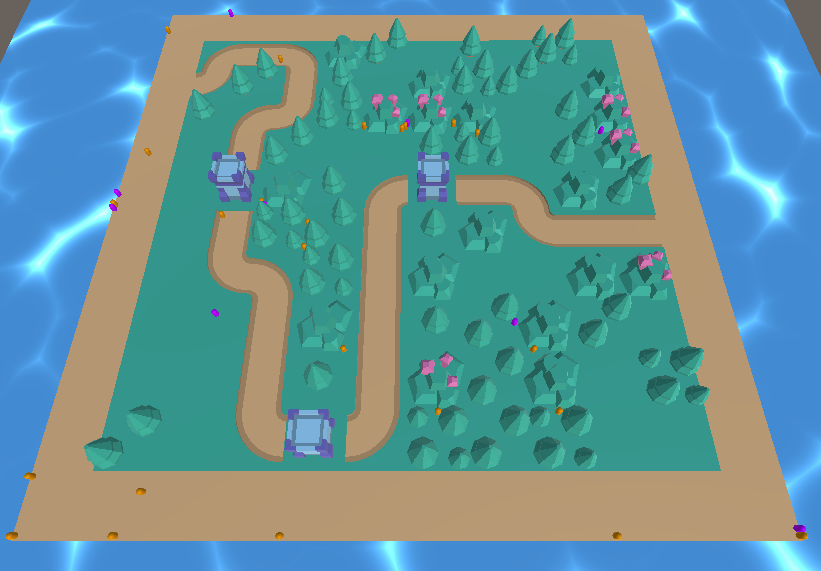
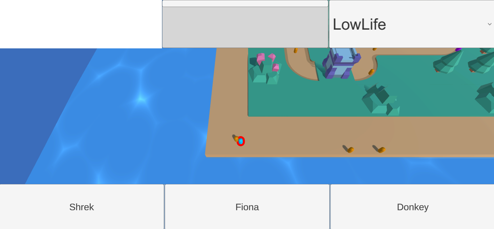

# Road to Far Far Away

Par Nathan Coustance & Donnovan Feuillastre

# Fiche signalétique

__Nom du jeu__ : Road to FarFarAway  
__Type de jeu__ : Reversed Tower Defense  
__Mode__ : Solo  
__Support__ : PC  
__Moteur__ : Unity 2020.3.23f1  
__Pitch__ : Aidez Shrek et ses amis à sauver chasser Lord Farquaad de son trône.
Rendez-vous à Far Far Away et prenez toutes les forteresses sur votre chemin pour libérer le pays de son oppresseur. 

# Inspirations

<table>
    <thead>
        <tr>
            <th>
Shrek
</th>
            <th>
TABS
</th>
            <th>
Advance Wars
</th>
        </tr>
    </thead>
    <tbody>
        <tr>
            <td><image src="images/shrek.gif" alt="shrek_gif"></td>
            <td><image src="images/tabs.gif" alt="tabs_gif"></td>
            <td><image src="images/advance_wars_2.gif" alt="advance_wars_gif"></td>
        </tr>
    </tbody>
</table>

# Gameplay

### __Units__

* __Allies__ : ce sont les unités possédées par le joueur. Chacune possède des points de vie, une cible, ainsi qu'un ordre, donné par le joueur, indiquant quel type de cible prendre en priorité.
* __Ennemies__ : ce sont les unités ennemies. Leur seul objectif est de défendre les tours en attaquant l'unité *Allies* la plus proche.

### __Unit Properties__

* __Damage__ : montant de dégats d'une attaque.
* __Fire rate__ : délai entre chaque attaque.
* __Max Health__ : montant maximum des points de vie.
* __Current Health__ : points de vie actuels de l'unité.
* __Move Speed__ : vitesse de déplacement de l'unité.
* __Cost__ : coût d'envoi de l'unité.
* __SearchingMethod__ : type de recherche des autres unités ennemis.

### __Ennemies__

* __Soldats__ : séparant le joueur des tours, ces unités sont les seuls défenseurs du royaume.
* __Tours__ : servant de garnisons aux unités ennemies, ces tours sont les cibles principales du joueur. À chaque fois qu'une est détruite, les autres s'améliorent et gagnent en puissance.

### __Spawning__

* __Canon__ : le joueur dispose d'un canon lui servant à envoyer ses unités au combat. Il dispose d'un choix entre plusieurs unités et est libre de les envoyer où il souhaite sur la map.
* __Tours__ : les unités ennemies apparaissent depuis les tours. Chaque tour faire apparaître régulièrement des unités pour se défendre.

### __End Conditions__

* __Winning condition__ : le joueur a détruit toutes les tours ennemies.
* __Losing condition__ : le joueur n'a plus assez d'argent pour se battre.

# Level Design

La création de la map est gérée de manière procédurale.

Le placement d'obstacles est tiré de cet article de recherche : https://www.researchgate.net/publication/224180076_Automatic_generation_of_game_elements_via_evolution.  
Il s'agit de placer les obstacles à la manière des déplacements d'un cavalier dans un jeu d'échecs.  
On place plusieurs cavaliers sur la map, puis on génère un obstacle à chacune de ses positions possibles de déplacement afin d'obtenir une répartition naturelle des obstacles.

Après avoir placé les obstacles, on créé le chemin en placant 2 points, chacun sur une extrémité du terrain.
On va ensuite utiliser l'algorithme de pathfinding A* afin de trouver un chemin reliant ces 2 points parmis les obstacles.  
Si aucun n'est trouvé, on essaye d'enlever aléatoirement des obstacles afin de dégager la voie pour un chemin.

Après avoir exécuté les étapes précédentes, on obtient une map correcte mais pouvant parfois être décevante.
Pour cela, nous avons implémenté un algorithme génétique permettant d'obtenir systématiquement de bons résultats grâce à une fonction de fitness et des paramètres adaptés.

# UX/UI

Les éléments d'informations sont affichés directement sur le HUD.  
En bas on trouve les différentes unités que le joueur peut envoyer au combat. Il suffit de cliquer sur l'un des boutons pour sélectionner l'unité correspondante et ainsi pouvoir l'envoyer en cliquant sur le terrain.  
En haut se trouvent les informations de l'unité actuellement sélectionnée. Les unités sélectionnables sont celles se trouvant sur le terrain. On peut ainsi consulter leurs points de vie actuels ainsi que modifier leur stratégie de combat.

# Défi

* Level Design procédural
* State Machine, Pattern d'ennemi, Intelligence Artificielle (*et/ou réseau*)
* Beaucoup d'intelligence artificielle en même temps

# Enjoy !

