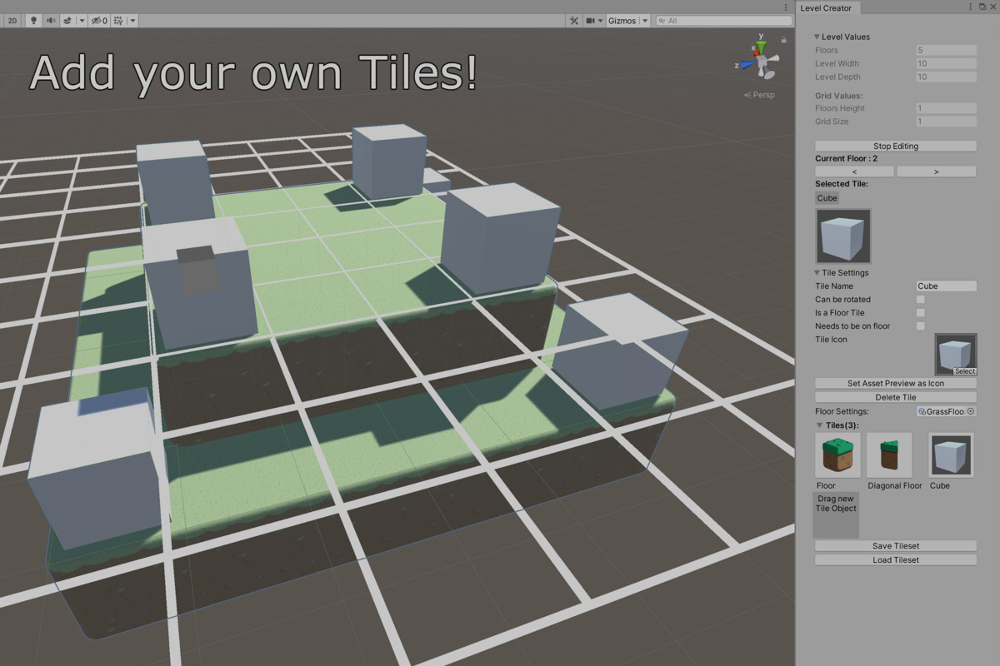
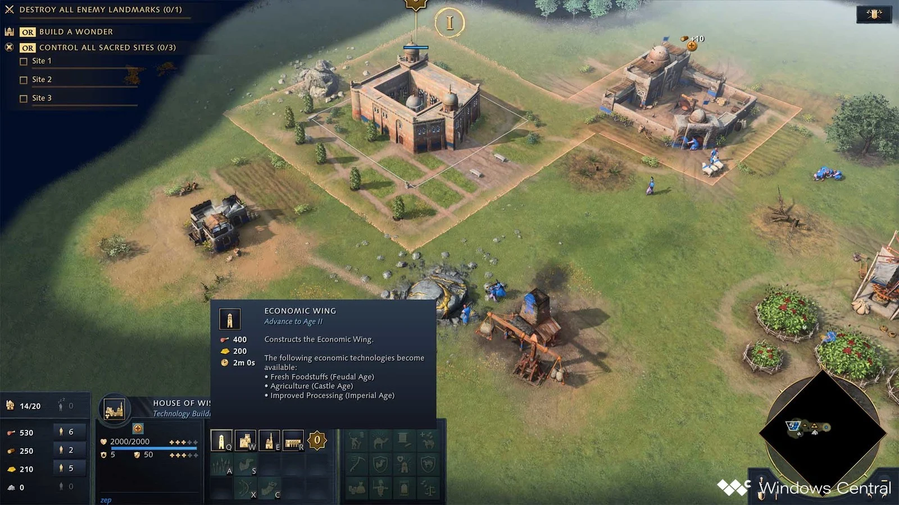
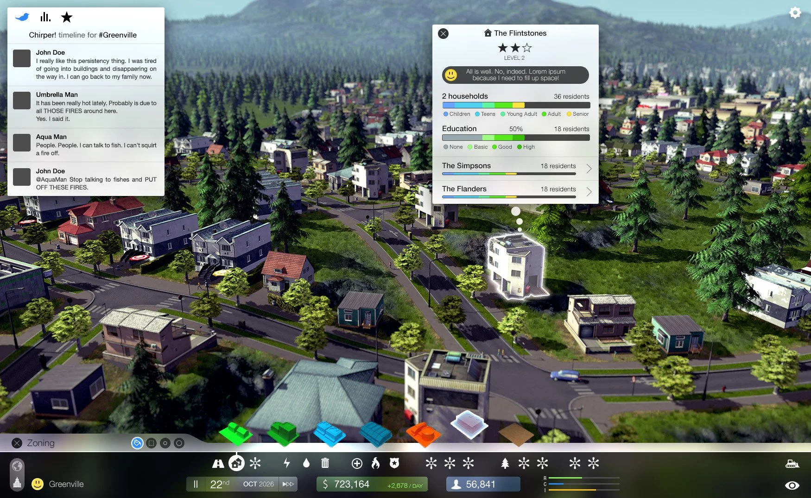
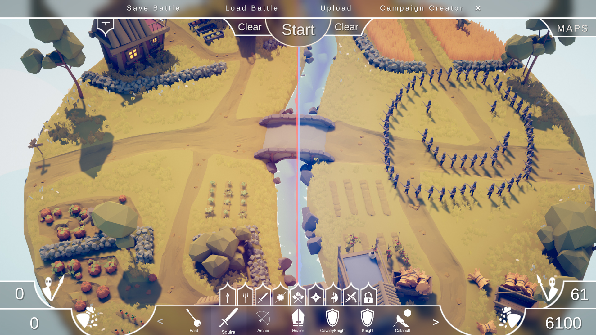

# Road to Far Far Away

[RoadMap](https://ticktick.com/pub/project/collaboration/invite/203cd3041ae44906886097e0191378bc?u=b8023e19ec5447aeb01da0c9e9a48d21)

# Fiche signalétique

__Nom du jeu__ : Road to FarFarAway  
__Type de jeu__ : Reversed Tower Defense  
__Mode__ : Solo  
__Support__ : PC  
__Moteur__ : Unity 2020.3.23f1  
__Pitch__ : Aidez Shrek et ses amis à sauver Fiona de Lord Farquaad à Far Far Away. Prenez toutes les forteresses sur votre chemin pour vous faire plus d'alliés à déployer lors de l'attaque de la ville. 

# Inspiration 

## Shrek

## Totally Accurate Battle Simulator

## Advance Wars

# Gameplay

### Spawn

* __Start__ : le joueur peut poser notre base sur une tile libre et tagger comme *__"Spawnable"__* 
* __Spawner__ : le joueur peut faire apparaitre ses unitées sur les tiles *__Spawner__*, ces tiles sont créer au départ et lorsqu'il détruit des bâtiments adverses.

### Actions

* __Movement__ : les unitées vont d'un point A vers un point B, si celui-ci est une cible elles attaques.
* __Attaque__ : l'unité inflige des dégats à celle qu'elle attaque.

### Ai Properties

* __Damage__ : dégats total qu'elle peut infliger aux unitées adverses sans malus
* __Max Health__ : point de vie total de l'unité lors de sa création
* __Current Health__ : point de vie actuel de l'unité
* __Move Speed__ : vitesse de déplacement de l'unité
* __Fire rate__ : temps entre chacun des coups de l'unité
* __Cost__ : coût de spawn de l'unité

### Player / Opponent

* __Max Money__ : argent total en debut de partie
* __Current Money__ : argent actuellement possédé par le joueur
* __Unit Counts__ : set de données contenant le nombre d'unité disponible pour chaque classe
* __Spawned Units__ : set de données contenant les unitées déjà en jeu

# Level Design

Le level design est géré par une TileMap. On défini un set de règles de construction avec différents set d'objets tile.   
L'ennemi a ses forts placés aléatoirement sur la TileMap, de préférences, au bords des routes.

# UX/UI

Le jeu aura une interface autour de la zone de jeu.
Des icones contextuelles qui permettent au joueur de spawn les différentes classes d'unitées.
*Il y a une carte du jeu dans l'écran qui montre la progression du joueur jusqu'au fort.*

# Défi

* Level Design procédural
* State Machine, Pattern d'ennemi, Intelligence Artificielle (*et/ou réseau*)
* Beaucoup d'intelligence artificielle en même temps